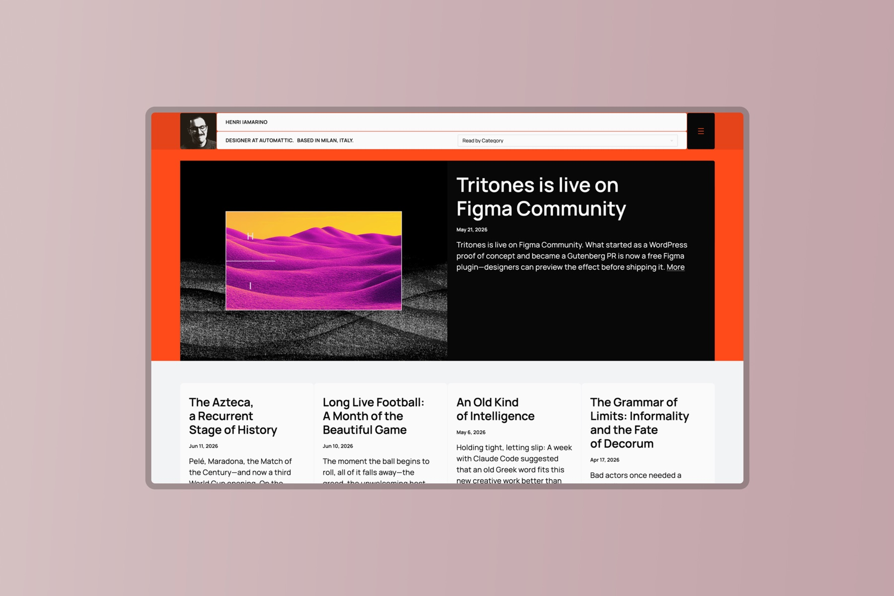
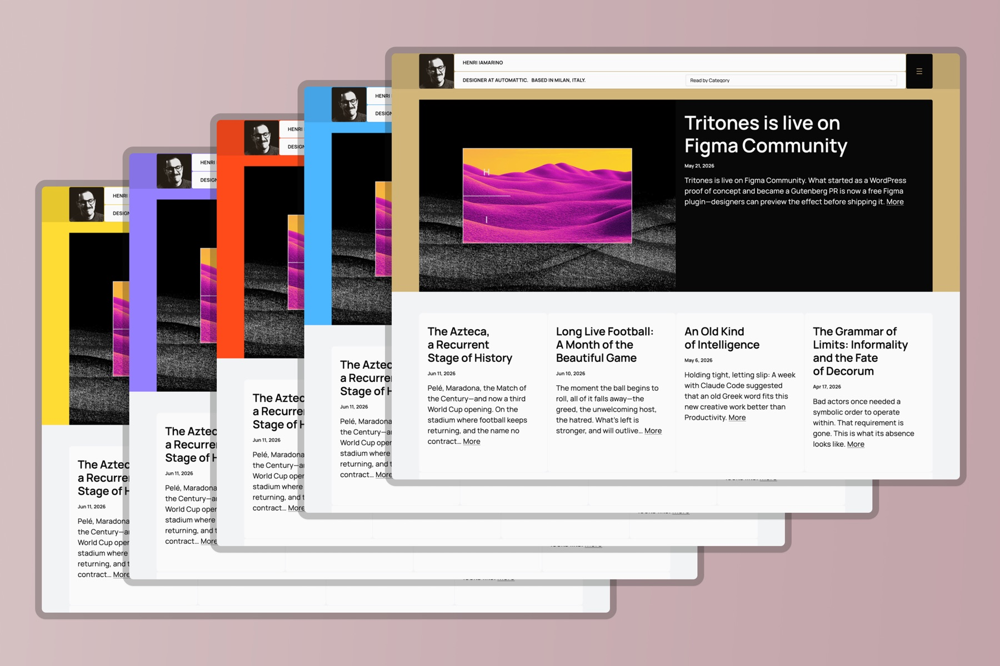
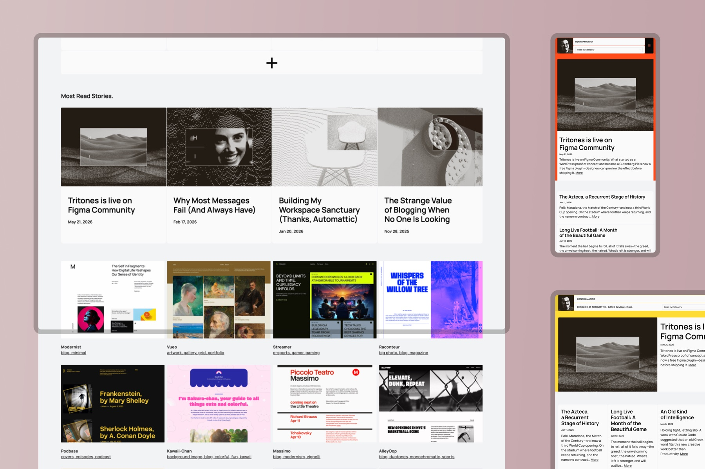
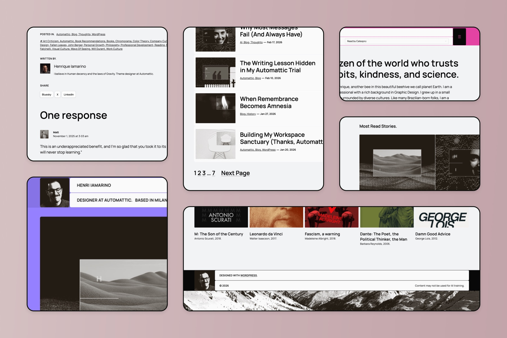
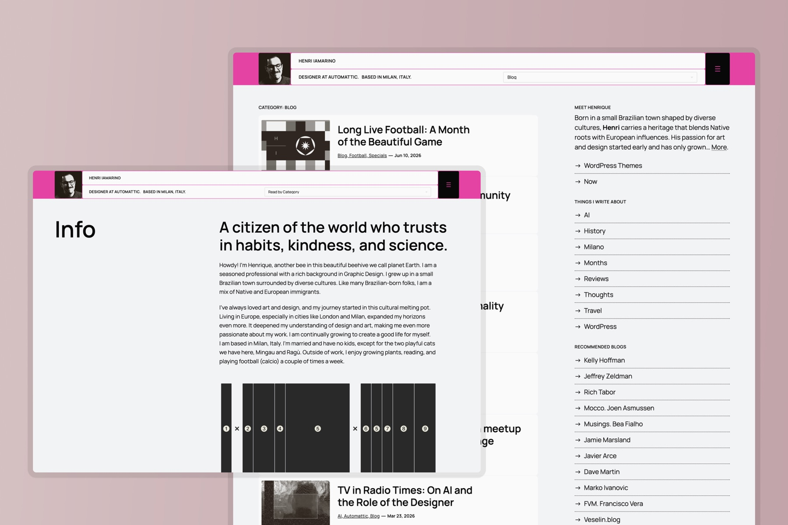
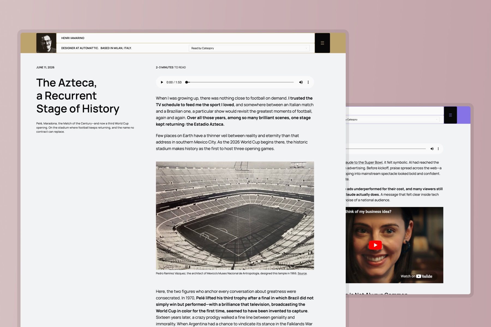

# I’m H25

**The block theme behind [iamarino.com](https://iamarino.com).** A personal publishing theme with a bold editorial header, Query Loop layouts built to show off many kinds of writing, and a palette that shifts its spirit on every visit.



I’m H25 is a custom WordPress block theme made for people who write. The header leads with a portrait, the menu, and the site’s categories right up front—an open invitation to dive into the writing. Throughout the experience, different Query Loop layouts give each kind of content its own stage, from long reads to quick notes to book reviews. It’s lightweight, clean, and tuned for a great read on any screen.

→ **See it live:** [iamarino.com](https://iamarino.com)

## Features

- **A powerful editorial header** — portrait, navigation, and categories displayed upfront to pull readers straight into the writing.
- **Many Query Loop layouts** — varied post grids and lists throughout, so different kinds of content each get a fitting stage.
- **A changing spirit** — the accent colour is picked at random on every visit, and never the same one twice in a row.
- **Lightweight & clean** — minimal CSS, mostly driven by `theme.json`; no page builders, no bloat.
- **Built for mobile** — responsive from the ground up for comfortable reading on any device.
- **A full block theme** — templates, parts, patterns, and global styles, all editable in the Site Editor.
- **One typeface, done right** — [Manrope](https://github.com/sharanda/manrope) under the Open Font License, and nothing else to load.

## A theme with a changing spirit



The palette is fixed but for one colour — the accent — chosen at random on every page load, and never landing on the same colour twice in a row. Buttons, links, and highlights all follow it, so the site feels a little new each time you arrive without ever losing its bones.

Adding your own colours is a one-line edit. In `functions.php`, extend the accent list and play as much as you like:

```js
var accents = [ '#ff4a1a', '#FFDD33', '#FF4AB5', '#4DB6FF', '#d2b579', '#9580ff' ];
```

The default — the colour shown when JavaScript is off — is the `contrast` preset in `theme.json`.

## Built for any device



Single-column on the phone, multi-column on the desktop, and the editorial feel intact at every width.

## A closer look

| Overview | Reading & topics | Single post |
|:---:|:---:|:---:|
|  |  |  |
| Query Loops, patterns, and parts | Categories and topics, upfront | Audio, video, and long-form reading |

## Requirements

- WordPress 6.9 or later
- PHP 7.2 or later

## Installation

1. Download the [latest version](https://github.com/henriqueiamarino/im-h25/archive/refs/heads/main.zip) (or clone this repository).
2. Copy the `im-h25` folder into `wp-content/themes/`.
3. Activate it under **Appearance → Themes**.

You can also install the ZIP directly from **Appearance → Themes → Add New → Upload Theme**.

## Credits

- Typeface: **Manrope** by the Manrope Project Authors, under the [SIL Open Font License 1.1](https://scripts.sil.org/OFL).
- Built as a block theme for the WordPress Site Editor.

## License

I’m H25 is free software, distributed under the **GNU General Public License v2.0 or later**. See [LICENSE](LICENSE) for the full text.
